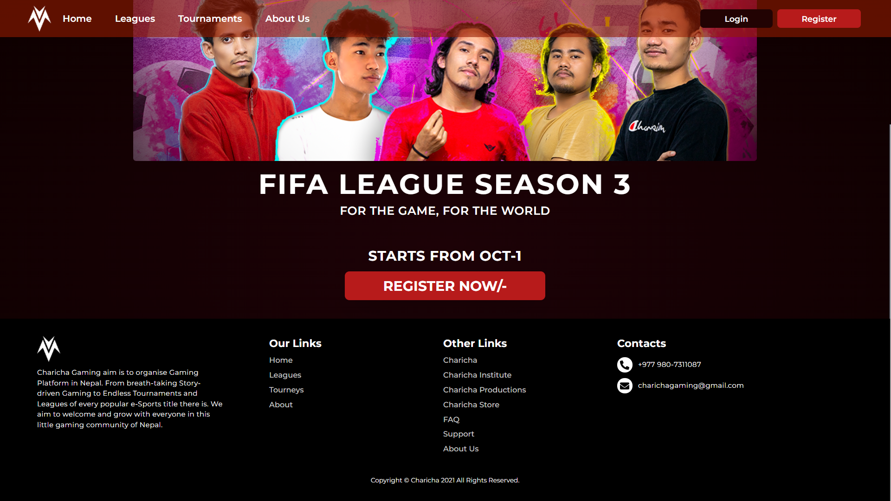
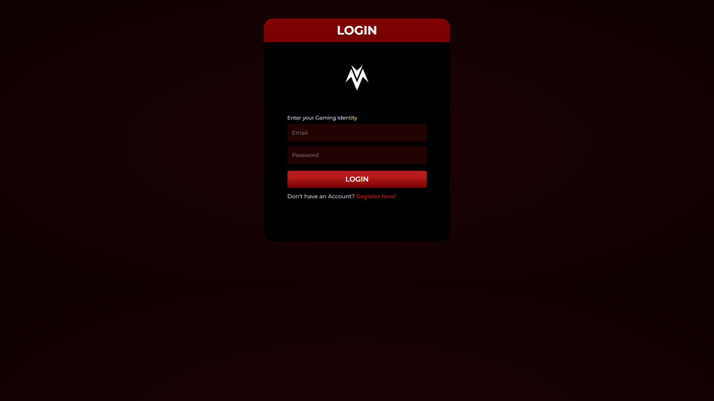

# Charicha League - Fifa League Season 3 - Online Registration System
Charicha gaming is introducing it's league and opening it's registration for Fifa S3 League online.

- Website to register for the Charicha League, Fifa League Season 3
- Mobile responsive site, where you can easily register using mobile
- Khalti Online Payment integration, so easy payment of the registration fee.

# Backend Architecture (Microservices API Gateway) 
We would like to create microservices for many business modules working independently.
All Business models will be created in Clean Architecture Pattern.

## Clean Architecture by Uncle Bob
- Independent of Frameworks. The architecture does not depend on the existence of some library of feature laden software. This allows you to use such frameworks as tools, rather than having to cram your system into their limited constraints.
- Testable. The business rules can be tested without the UI, Database, Web Server, or any other external element.
- Independent of UI. The UI can change easily, without changing the rest of the system. A Web UI could be replaced with a console UI, for example, without changing the business rules.
- Independent of Database. You can swap out Oracle or SQL Server, for Mongo, BigTable, CouchDB, or something else. Your business rules are not bound to the database.
Independent of any external agency. In fact your business rules simply don't know anything at all about the outside world.

	
# Milestones
- Create Khalti Verification API for server

## Login

# Scenario 
1. User registers in charichaleague by going to our website www.charichaleague.com (currently not live.)
2. User register for Fifa League Season 3 from available Tourneys.
3. User gets Fifa League Season 3 unique registration ID.
4. When the league starts user comes in the event and verifies himself with reg ID from previous.
5. User plays his match and gets his updates on his profile.

# API 
	- Status 
		- 'success'
			Successful query.
		- 'fail'
			Failed query.
			
# API Resources
## Users
	-  A User Resource Represents a single user, containing properties, 
		- first_name
		- last_name
		- gaming_name
		- email
		- password
		- ...etc

## Role Based Users Usage | Access Control API
	Access Control is done with JWT Token. 

### Gamer
- Can register play tournaments overall Charicha Gaming main focus

### Moderator 
- Upper Level role handling all sorts of managing, users/gamers created by Manager to handle tourneys.
- Kind of support group for Manager in handling Charicha Gaming Tourneys.

### Manager
- Can Create, Manage and Organize any kind of Leagues, Tourneys, etc.
- Can Block, Kick, and take certain decisions based on the leagues, and tourneys they're managing.

### Editor 
- Editor can handle other managers.

### Admin
- In charge of handling users, moderator, managers, users roles,  any kind of upper lever permissions is given to admin.

### Ranks for all Users
Whatever role you may have, by heart we are all gamers in this Community. So, everyone gets a rank.
From Manager to Admin, we have got ranks for all.

### Rank hierarchy, 
- Noob
- Amatuer
- Semi-pro
- Pro
- Elite
- Candidate Master
- Master
- World-Class
- Legendary
- Immortal

## Matches
- A Match Resource Represents a single match. 

## Tourneys
- A Tourney Resource Represents a single Tourney.

